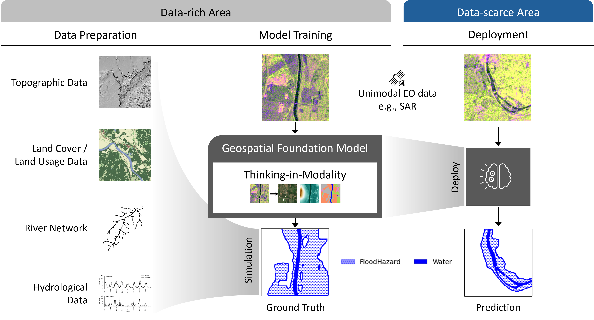
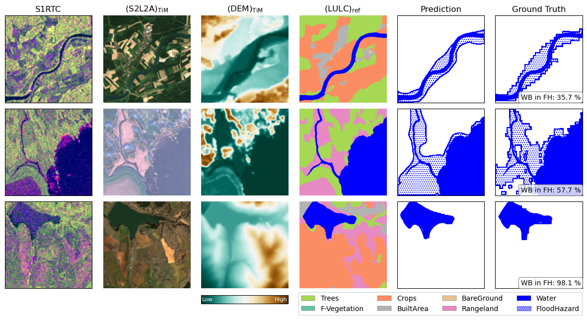

# ZeroFlood: Flood Hazard Mapping from Single-Modality SAR Using Geo-Foundation Models




Updated
- [2026-03-01] Paper was accepted at EUSAR 2026!
- [2025-08-01] ZeroFlood was selected as a Winner of [TerraMind Blue-sky challenge](https://huggingface.co/spaces/ibm-esa-geospatial/challenge).

## Dataset

Fine-tuning dataset is accessible via [HuggingFace](https://huggingface.co/datasets/khyeongkyun/ZeroFlood). Each modality in the split are zipped (e.g., `./train/S1RTC.zip`). Please unzip before using it.
```
$ hf download khyeongkyun/ZeroFlood --repo-type=dataset
```
If you need to reproduce or modify dataset generation algorithm, you should download source datasets first: [TerraMesh](https://huggingface.co/datasets/ibm-esa-geospatial/TerraMesh) and [LISFLOOD](https://data.jrc.ec.europa.eu/dataset/1d128b6c-a4ee-4858-9e34-6210707f3c81#dataaccess). You can download all at once with a python script below.
```
$ python ./data/download.py -d all -m LULC,S1RTC,S2L2A,S2RGB,DEM -r /PATH/TO/SAVE
```
After then, use `./data/preprocess.py` to reproduce ZeroFlood dataset.
```
$ python ./data/preprocess.py -s all -r /PATH/OF/DATASET/ROOT
```

## Fine-tuning

### Setup

Our fine-tuning process follows the [Pangaea benchmark](https://github.com/VMarsocci/pangaea-bench). Changes from the original source are described in [UPDATE.md](./UPDATE.md)

To do so, install required packages in `environment.yaml`.

1. First clone the Pangaea repository. We recommend to use **mamba/micromamba** for faster installation.
    ```
    $ micromamba env create -f environment.yaml
    ```
2. Lastly, install the Pangaea-benchmark code repository as a development package.
    ```
    $ micromamba activate zeroflood-eusar
    $ pip install --no-build-isolation --no-deps -e .
    ```

### Training and evaluation

Pangaea benckmark code runs fine-tuning and evaluation together. Here is an example of TerraMind TiM encoder with ZeroFlood dataset.

```
torchrun --nnodes=1 --nproc_per_node=1 pangaea/run.py \
   --config-name=train \
   dataset=zeroflood_sar \
   dataset.root_path=/path/to/zeroflood \
   encoder=terramind_base_sar_tim \
   encoder.merge_method=mean \
   encoder.encoder_weights=/path/to/terramind \
   'encoder.tim_modalities=[S2L2A,LULC,DEM]' \
   decoder=seg_upernet \
   preprocessing=seg_default \
   criterion=cross_entropy \
   task=segmentation \
   task.trainer.log_interval=100 \
   batch_size=16
```
> [!TIP]
> You can also find slurm bash scripts at `./script/pangaea-bench`.

#### Results and checkpoints

|       Model      |   F1  | Hit Rate | True Alarm | ckpt     |
|:----------------:|:-----:|:--------:|:----------:|----------|
|       UNet       | 84.66 |   81.00  | 88.67      | [link](https://huggingface.co/khyeongkyun/zeroflood-baseline-unet) |
|        ViT       | 84.64 |   81.46  | 88.08      | [link](https://huggingface.co/khyeongkyun/zeroflood-baseline-vit) |
|    SSL4EO-MAE    | 85.23 |   81.39  | 89.44      | [link](https://huggingface.co/khyeongkyun/zeroflood-gfm-ssl4eo-mae) |
|       CROMA      | 83.63 |   79.72  | 87.95      | [link](https://huggingface.co/khyeongkyun/zeroflood-gfm-croma) |
|       DOFA       | 86.90 |   84.80  | 89.11      | [link](https://huggingface.co/khyeongkyun/zeroflood-gfm-dofa) |
|     TerraMind    | 88.36 |   86.77  | 90.02      | [link](https://huggingface.co/khyeongkyun/zeroflood-gfm-terramind) |
| TerraMind-TiM-sd | 89.50 |   88.98  | 90.03      | [link](https://huggingface.co/khyeongkyun/zeroflood-gfm-terramind-tim) |


### Inference

```
torchrun --nnodes=1 --nproc_per_node=1 --master_port $MASTER_PORT \
   pangaea/run.py \
   --config-name=test \
   ckpt_dir=$CKPT_DIR \
   save_pred=true
```

## Citation
If you refer ZeroFlood in your research, please cite the ZeroFlood paper.

```
@misc{kim2025zerofloodgeospatialfoundationmodel,
      title={ZeroFlood: A Geospatial Foundation Model for Data-Efficient Flood Susceptibility Mapping}, 
      author={Hyeongkyun Kim and Orestis Oikonomou},
      year={2025},
      eprint={2510.23364},
      archivePrefix={arXiv},
      primaryClass={cs.LG},
      url={https://arxiv.org/abs/2510.23364}, 
}
```

